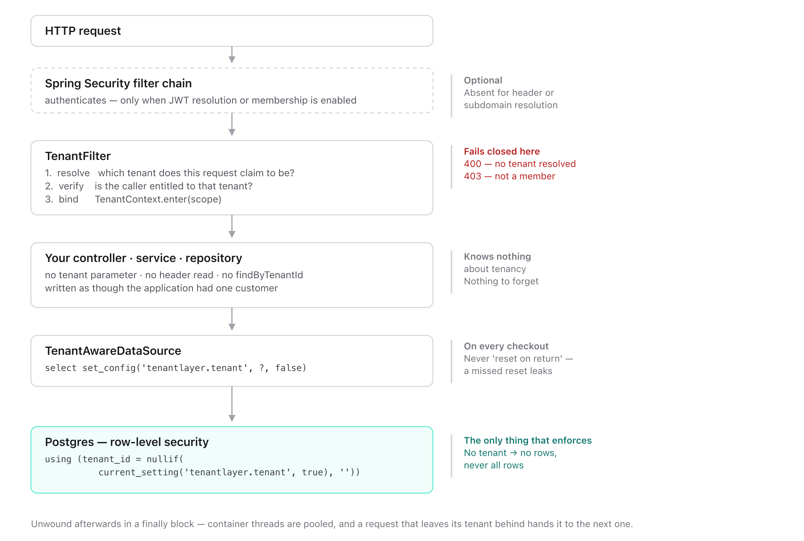

# Architecture

## The path of one request

<picture>
  <source media="(prefers-color-scheme: dark)" srcset="images/architecture-dark.png">
  
</picture>

The important property is that **nothing in the middle knows about tenancy**. Your
controller, service and repository are written as if the application had one customer. The
tenant is established before them and enforced after them.

Concretely, one request:

```
GET /orders            X-Tenant-ID: acme
  │
  ├─ Spring Security authenticates                (optional)
  ├─ TenantFilter                                  resolve → "acme"
  │                                                verify   → is this caller entitled to it?
  │                                                bind     → TenantContext = "acme"
  │
  ├─ OrderController.list()                        ← your code. Knows nothing about tenants.
  ├─ OrderRepository.findAll()                     ← "select * from orders", unfiltered
  │
  ├─ TenantAwareDataSource.getConnection()         select set_config('tenantlayer.tenant','acme',false)
  └─ Postgres                                      policy applies → acme's rows only
                                                   ↑ the only component that ENFORCES
  │
  └─ TenantFilter unwinds                          TenantContext cleared, always
```

The important property is that the two lines marked *your code* are unchanged from a
single-tenant application. Isolation is established before them and enforced after them.

## Components, and what each is responsible for

| Component | Responsibility | Fails how |
|---|---|---|
| `TenantResolver<S>` | Reports which tenant a request *claims* | Returns empty; the chain falls through |
| `TenantResolverChain` | Ordered precedence, first match wins | — |
| `TenantMembershipVerifier` | Decides whether the caller is *entitled* to that tenant | Returns false → 403, before any binding |
| `TenantFilter` | Binds the scope for the request, unwinds it after | No tenant + strict → 400 |
| `TenantContext` | The single place the current tenant is read or written | `require()` throws `NoTenantException` |
| `TenantContextStorage` | Where the value physically lives (ThreadLocal today) | — |
| `TenantTaskDecorator` / `TenantExecutors` | Carry the scope across thread boundaries | Task runs with no tenant → reads nothing |
| `TenantAwareDataSource` | Publishes the tenant onto every pooled connection | Connection is closed rather than handed over |
| `TenantRegistry` | Who the tenants are | Throws `TenantRegistryException` |
| Postgres RLS policy | **Enforces** | Returns no rows |

Only the last row enforces. Everything above it is plumbing whose job is to make sure the
database is asked the right question.

## Why the enforcement lives in the database

An ORM filter constrains what the ORM asks for. A native query, a `JdbcTemplate` call, a
bulk `update ... where`, a reporting tool on the same credentials, a psql session — none of
those pass through it. A row-level security policy is applied by Postgres to every statement
on that connection, regardless of who wrote it or how.

That is the whole reason this design puts the predicate in the database and treats the Java
side as wiring. It also means TenantLayer can be removed and your isolation still holds:
the policies are plain SQL you own.

## Three decisions worth understanding

### The tenant is set on checkout, not reset on return

The obvious design is: set the tenant when there is one, reset it when the connection goes
back to the pool. It has a hole. If the reset is missed — an exception on the return path, a
code path that bypasses close — the value rides back into the pool and the next borrower
inherits it silently.

Setting it on *every* checkout means a connection can never be **used** carrying a stale
tenant, because the value is overwritten before the borrower can issue a statement. It is
also one round trip instead of two.

This is the entire mechanism, run before the borrower sees the connection:

```sql
select set_config('tenantlayer.tenant', 'acme', false)
```

Parameterised, never interpolated — the tenant identifier may have arrived in an HTTP
header, and building that statement by concatenation would be SQL injection with
attacker-controlled input. `false` means session scope rather than transaction scope; see
below.

### No tenant is written as the empty string, not left alone

With nothing bound, the setting is written as `''`. The generated policy compares against
`nullif(current_setting('tenantlayer.tenant', true), '')`, so absence evaluates to NULL and
matches no rows.

Absence of a tenant therefore returns **nothing**, never everything. Fail-closed is a
property of the SQL, not of remembering to check.

### Session scope, not `SET LOCAL`

`SET LOCAL` only survives inside an explicit transaction, and plenty of reads run in
autocommit. Session scope with an unconditional overwrite on checkout gives the same safety
without requiring every read to be transactional.

### Transaction scope is an explicit alternative

`ROW_LEVEL_SECURITY_TRANSACTION_SCOPED` is the opt-in strategy for PgBouncer transaction
pooling and equivalent proxies. Spring's transaction execution listener binds the current
tenant after the transaction manager has applied isolation and other transaction settings.
A connection-only wrapper provides the same bind-before-first-use fallback for manually
constructed JDBC managers. It uses `set_config(..., true)`, so commit and rollback remove the
setting automatically. Tenant-scoped statements prepared while no transaction is active are
rejected; shared registry reads remain available before a tenant exists, and the checkout
reset keeps all other no-tenant reads fail-closed. The wrapper leaves statements, result sets,
metadata, vendor interfaces, and `Connection.unwrap(...)` behavior intact after binding. This
strategy is not a default because it makes every tenant-scoped read, including repository
calls outside `@Transactional`, require an explicit transaction.

## Extension points

Each is one interface, and defining a bean makes the autoconfiguration back off. None of
them requires subclassing anything or extending a base class:

```java
// Resolve from an API key, an mTLS certificate, a message header.
public interface TenantResolver<S> {
    Optional<String> resolve(S source);
}

// Back membership with a database table, mTLS, an internal token.
// The caller comes from the SecurityContext, so only the tenant is passed.
public interface TenantMembershipVerifier {
    boolean isMember(String tenantId);
}

// Keep tenants somewhere other than a table.
public interface TenantRegistry {
    Optional<TenantRegistration> find(String tenantId);
    List<String> activeTenantIds();
    // ...
}

// Choose the connection itself — this is how database-per-tenant works.
public interface TenantConnectionStrategy {
    Connection getConnection() throws SQLException;
    String name();
    // Methods added later are `default`, because you implement this.
}
```

`TenantContextStorage` is the fifth, for swapping where the tenant physically lives — see
[context storage](context-storage.md).

A one-line example of each is in [tenant resolution](tenant-resolution.md#writing-your-own)
and [isolation strategies](isolation-strategies.md).

## What is deliberately not in the path

- **No agent, no bytecode weaving, no proxy of your entities.** The only wrapping is a
  `DataSource` delegate.
- **No phone-home, no telemetry.**
- **No runtime dependency on the registry** for request handling — the registry is consulted
  for iteration and, if you enable it, membership. A request that resolves from a token does
  not touch it.
- **No enforcement in Java.** Statement-level enforcement is a separate, paid concern
  precisely because doing it in Java is a weaker guarantee than doing it in the database.

## Known ways isolation can still be bypassed

Documented rather than hidden, because you should design around them:

1. **Connecting as a superuser, or as the table owner without `FORCE ROW LEVEL SECURITY`.**
   Both bypass policies by design. This is the single most common cause of "my policy is not
   working" — and of test suites that pass for the wrong reason.
2. **Unwrapping a pooled connection to a raw `PgConnection`.** Code that does this holds a
   connection outside the wiring from that point on. The session variable is still set, so
   policies still apply — but anything that changes the session is now your responsibility.
3. **PgBouncer in transaction or statement pooling mode.** The tenant is session-level
   state, and in those modes a server connection is yours for only one transaction — so the
   setting can outlive your use of it and be visible to another client. Session pooling is
   fine. See [Row-level security](row-level-security.md#connection-poolers-read-this-if-you-use-pgbouncer).
4. **Caching, if you disable it.** A cache hit never reaches the database, so no policy
   can help. TenantLayer qualifies cache keys by tenant for exactly this reason — but
   setting `tenantlayer.cache.enabled=false`, or naming a tenant-scoped cache under
   `tenantlayer.cache.shared`, reopens it. See [Caching](caching.md).
